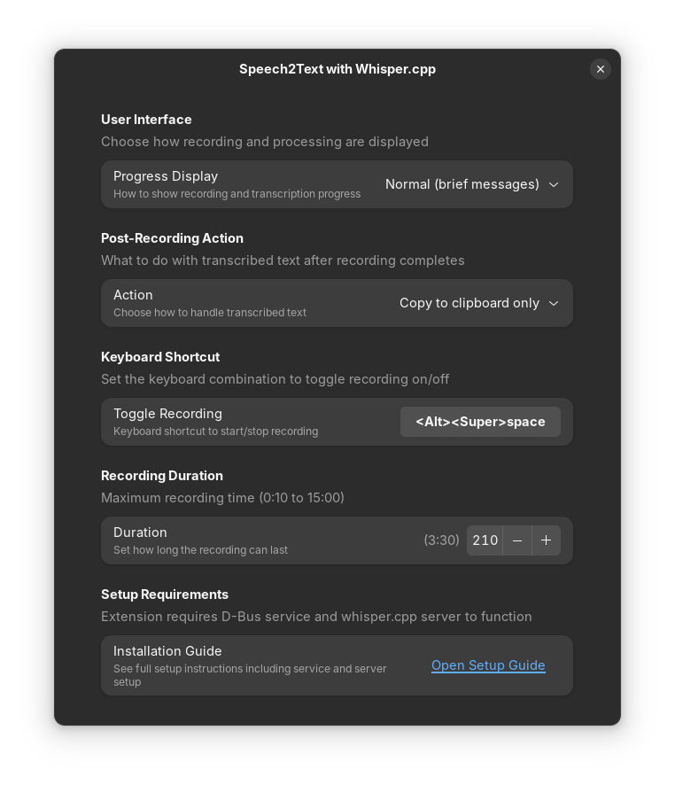

# GNOME Speech2Text using Whisper.cpp

**Press shortcut → Speak → Get Text**

Local speech-to-text for GNOME Shell. No cloud. No APIs.

Status indicator in system tray (top-right panel) always shows recording/processing state.

## Choose Your Experience

- **Minimal** - Errors only, stay-out-of-the-way mode
- **Normal** - Brief notifications, multitask while recording
- **Focused** - Modal during recording only, transcription in background
- **Blocking** - Full-screen modal, focused workflow (blocks during recording + transcription)

## Features

- Tray icon presents status (Idle/Recording/Transcribing)
- Keyboard shortcut (Super+Alt+Space)
- Multi-language support
- Auto text insertion (X11 only) or clipboard
- Customizable models and Voice Activity Detection
- Fast local transcription (no cloud/APIs)

## How It Works

Three components required:
- **Extension** - GNOME Shell UI, shortcuts, dialogs
- **D-Bus Service** - Python backend (audio recording, processing)
- **whisper.cpp** - [ggerganov/whisper.cpp](https://github.com/ggerganov/whisper.cpp) server for transcription

All three must be installed separately (see Installation below).

## Installation

### Quick Install (Recommended)

Install extension from [extensions.gnome.org](https://extensions.gnome.org/extension/8706/speech2text-with-whispercpp/), then:

**1. Install Dependencies**

```bash
# Ubuntu/Debian
sudo apt install build-essential cmake python3 pipx ffmpeg python3-dbus python3-gi wl-clipboard xdotool xclip

# Fedora
sudo dnf install gcc gcc-c++ cmake python3 pipx ffmpeg python3-dbus python3-gobject wl-clipboard xdotool xclip
```

**2. Install whisper.cpp**

```bash
# Clone
git clone https://github.com/ggml-org/whisper.cpp.git
cd whisper.cpp

# Build with CUDA support (NVIDIA GPU)
cmake -B build -DGGML_CUDA=1 -DCMAKE_INSTALL_PREFIX=~/.local
cmake --build build -j --config Release
cmake --install build

# Add to shell environment (~/.bashrc or ~/.zshrc) for CLI usage
echo 'export PATH="$HOME/.local/bin:$PATH"' >> ~/.bashrc
echo 'export LD_LIBRARY_PATH="$HOME/.local/lib:$LD_LIBRARY_PATH"' >> ~/.bashrc
source ~/.bashrc

# Add to GNOME environment for the service
mkdir -p ~/.config/environment.d
cat >> ~/.config/environment.d/custom-env.conf <<EOF
PATH=$HOME/.local/bin:\$PATH
LD_LIBRARY_PATH=$HOME/.local/lib:\$LD_LIBRARY_PATH
EOF

# Download models
mkdir -p ~/.cache/whisper.cpp
./models/download-ggml-model.sh base ~/.cache/whisper.cpp
./models/download-vad-model.sh silero-v5.1.2 ~/.cache/whisper.cpp

cd ..
```

**CPU-only build:** Replace first cmake line with:
```bash
cmake -B build -DCMAKE_INSTALL_PREFIX=~/.local
```

**3. Install Service**

```bash
pipx install --system-site-packages \
  'git+https://github.com/bcelary/gnome-speech2text.git#subdirectory=service'
speech2text-whispercpp-setup
```

Restart GNOME Shell (X11: `Alt+F2` → `r`, Wayland: log out/in)

### Development Install

For developing or contributing:

```bash
git clone https://github.com/bcelary/gnome-speech2text.git
cd gnome-speech2text
make install  # Installs both service and extension
```

Follow steps 1-2 above for dependencies and whisper.cpp.

Restart GNOME Shell (X11: `Alt+F2` → `r`, Wayland: log out/in)

## Configuration

**Service** (optional - create/edit `~/.config/environment.d/custom-env.conf`):
```bash
# These environment variables must be in ~/.config/environment.d/custom-env.conf
# so GNOME Shell can see them (not ~/.bashrc)

WHISPER_MODEL=small           # tiny, base, small, medium, etc.
WHISPER_LANGUAGE=auto         # auto, en, es, fr, de, etc.
WHISPER_VAD_MODEL=auto        # auto, none, silero-v5.1.2
WHISPER_SERVER_URL=http://localhost:8080
S2T_SERVICE_LOG_LEVEL=info    # error, warn, info, debug
```

After editing, restart GNOME Shell or log out/in.

**Extension** (right-click microphone icon → Settings):
- **Progress Display** - Always (blocks screen) / Focused (blocks recording only) / Normal (brief messages) / Errors only
- **Post-Recording Action** - Show preview dialog / Auto-type text (X11 only) / Copy to clipboard only / Auto-type and copy (X11 only)
- **Keyboard Shortcut** - Default: Super+Alt+Space
- **Recording Duration** - 10 seconds to 15 minutes

**Extension Logging** (optional - add to `~/.config/environment.d/custom-env.conf`):
```bash
S2T_LOG_LEVEL=info    # error, warn, info, debug
```


> *Extension preferences for customizing behavior and keyboard shortcuts*

## Usage

1. Press `Super+Alt+Space` (or click microphone icon)
2. Speak
3. Obtain the result or Review transcription and Act (if using preview action)

## Troubleshooting

**Check installation:**
```bash
make status
gnome-extensions enable speech2text-whispercpp@bcelary.github
```

**View logs:**
```bash
./scripts/tail-logs.sh              # Extension logs
./scripts/tail-service-logs.sh      # Service logs
```

**Note:** Text insertion requires X11. On Wayland, use clipboard mode.

## Development

```bash
make help                    # See all available targets
```

For service development, see [service/README.md](./service/README.md).

## Uninstall

```bash
make uninstall
```

## License

MIT - see [LICENSE](LICENSE)

Forked from [kavehtehrani/gnome-speech2text](https://github.com/kavehtehrani/gnome-speech2text)
