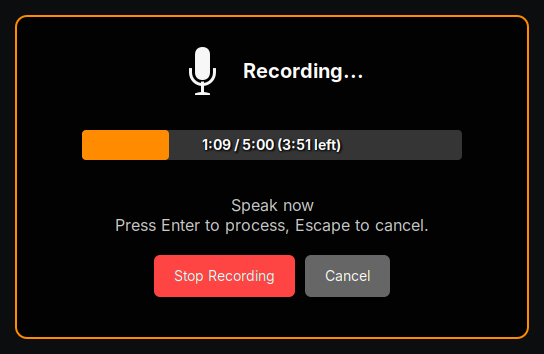

# GNOME Speech2Text using Whisper.cpp

Local speech-to-text for GNOME Shell using [whisper.cpp](https://github.com/ggerganov/whisper.cpp). Record audio with a keyboard shortcut, transcribe locally, and insert text at cursor or copy to clipboard.



## Features

- Fast local transcription using whisper.cpp (no cloud APIs)
- Multi-language support
- Quick access via keyboard shortcut (Super+Alt+Space)
- Automatic text insertion (X11) or clipboard copy (Wayland)
- Customizable Whisper models and Voice Activity Detection

## Installation

### Full Installation

**1. Install Dependencies**

```bash
# Ubuntu/Debian
sudo apt install python3 pipx ffmpeg python3-dbus python3-gi wl-clipboard xdotool xclip

# Fedora
sudo dnf install python3 pipx ffmpeg python3-dbus python3-gobject wl-clipboard xdotool xclip
```

**2. Install whisper.cpp**

```bash
git clone https://github.com/ggerganov/whisper.cpp
cd whisper.cpp
make server && sudo make install
bash ./models/download-ggml-model.sh base ~/.cache/whisper.cpp
cd ..
```

**3. Install Extension & Service**

```bash
git clone https://github.com/bcelary/gnome-speech2text.git
cd gnome-speech2text
make install  # Installs both service and extension
```

Restart GNOME Shell (X11: `Alt+F2` → `r`, Wayland: log out/in)

### Service Only (Extension from GNOME Extensions)

If you installed the extension from extensions.gnome.org:

**1. Install Dependencies** (same as above)

**2. Install whisper.cpp** (same as above)

**3. Install Service**

```bash
pipx install --system-site-packages \
  'git+https://github.com/bcelary/gnome-speech2text.git#subdirectory=service-whispercpp'
speech2text-whispercpp-setup
```

Restart GNOME Shell

## Configuration

**Service** (optional - edit `~/.config/environment.d/custom-env.conf`):
```bash
WHISPER_MODEL=small                       # tiny, base, small, medium
WHISPER_LANGUAGE=auto                     # auto, en, es, fr, de, etc.
WHISPER_VAD_MODEL=auto                    # auto, none
WHISPER_SERVER_URL=http://localhost:8080
```

**Extension** (right-click microphone icon → Settings):
- Keyboard shortcut
- Recording duration (10-300 seconds)
- Post-recording action (preview, auto-type, copy to clipboard)

## Usage

1. Press `Super+Alt+Space` (or click microphone icon)
2. Speak
3. Review transcription
4. Click Insert or Copy

## Troubleshooting

**Check installation:**
```bash
make status
gnome-extensions enable speech2text-whispercpp@bcelary.github
```

**View logs:**
```bash
./scripts/tail-logs.sh              # Filters extension's logs
journalctl -f -t speech2text-whispercpp-service  # Service logs
```

**Note:** Text insertion requires X11. On Wayland, use clipboard mode.

## Development

```bash
make help                    # See all available targets
./scripts/tail-logs.sh       # View extension logs
```

For service development, see [service-whispercpp/README.md](./service-whispercpp/README.md).

## Uninstall

```bash
make uninstall
```

## License

MIT - see [LICENSE](LICENSE)

Forked from [kavehtehrani/gnome-speech2text](https://github.com/kavehtehrani/gnome-speech2text)
